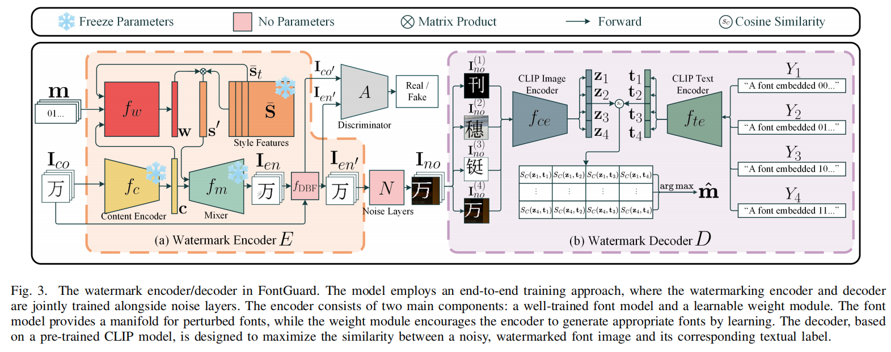
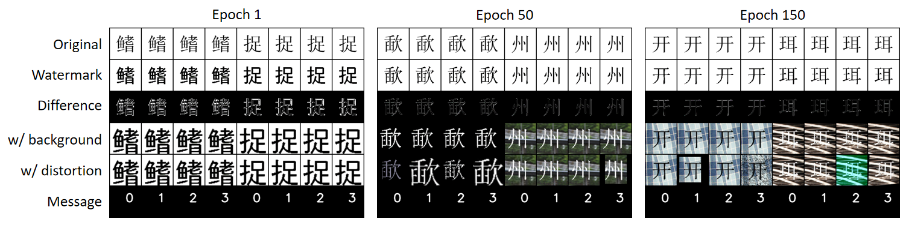

# FontGuard

[](https://arxiv.org/abs/2504.03128)
[](https://arxiv.org/abs/2504.03128)

> **FontGuard** is a robust font watermarking framework that embeds bits by manipulating font style representations (instead of only pixel-space perturbations), then decodes them with contrastive learning for stronger distortion robustness.



---

## ✨ Highlights

- **Style-space watermarking** with a font generator prior for better visual quality.
- **Contrastive decoder training** for stable bit recovery.
- **Noise-aware curriculum** that improves robustness under real-world distortions.
- **Demo assets included** for 1-bit SimSun watermarking and multi-scenario evaluation.



---

## 📦 Repository Layout

```text
FontGuard/
├── main.py               # training entry
├── cfg.py                # training configuration
├── ds.py                 # dataloader (font + random background)
├── model/                # encoder/decoder/discriminator + noise layers
├── fig/                  # figures used in docs
└── demo/
    ├── test.py           # demo evaluation entry
    ├── demo_cfg.py       # demo config template
    └── README.md         # demo data details
```

---

## 🚀 Quick Start

### 1) Environment

Install dependencies in your Python environment:

```bash
pip install torch torchvision numpy pillow tqdm
```

> If your setup differs (CUDA / PyTorch version constraints), install the matching PyTorch build first, then install the remaining packages.

### 2) Prepare data and pretrained files

Set the `root` directory in `cfg.py`, then place required files under that root:

- font images (`font_dir`, default: `root/SimSun`)
- mean style feature (`base_sty_path`)
- pretrained decoder checkpoint (`pretrain_dec_ckpt`)
- background images (`bg_dir`, default: `root/val2017`)

Pretrained resources:
- [Google Drive](https://drive.google.com/drive/folders/1n9l8sXo2mLh7a3e5j6v0Zt9sXq8z9b?usp=sharing)

Recommended `exp_data` layout (matching `cfg.py` defaults):

```text
exp_data/
├── SimSun/                      # training font images (ImageFolder style)
│   └── <font-subdir>/
│       ├── 0000.png
│       └── ...
├── val2017/                     # background images (e.g., COCO val2017)
├── base_sty_feat_CH.pth         # extracted mean style feature
├── clip_cls_CH.pt               # pretrained decoder checkpoint
├── font_model_CH.ckpt           # pretrained font recognition model
└── SimSun YYYY.MM.DD--HH-MM-SS/ # auto-created per run (`exp_dir`)
    ├── SimSun.log
    ├── train.csv
    ├── eval.csv
    ├── tb-logs/
    ├── vis_img/
    ├── ckpt/
    └── checkpoints/
```

> Note: the timestamped run directory is created automatically at startup.

### 3) Organize font images correctly

`ds.py` uses `torchvision.datasets.ImageFolder`, so images must be inside at least one subfolder:

```text
SimSun/
└── <font-subdir>/
    ├── 0000.png
    ├── 0001.png
    └── ...
```

Expected image size is **80×80** (configured by `font_img_size` in `cfg.py`).

### 4) Train

```bash
python main.py
```

Training outputs are written to `exp_dir` (auto-created in `cfg.py`), including checkpoints and visualization images.

---

## ⚙️ Key Configuration (`cfg.py`)

- `msg_bit`: watermark bit length (default `1`, so `msg_n=2` classes)
- `font_dir`, `bg_dir`: font/background data directories
- `font_model_ckpt`, `base_sty_path`, `pretrain_dec_ckpt`: required model assets
- `epochs`, `bs`, `enc_lr`, `dec_lr`, `disc_lr`: training schedule and optimization
- `init_epoch`, `start_noise_epoch`, `full_noise_epoch`: curriculum stages

> `main.py` sets `CUDA_VISIBLE_DEVICES` internally. Adjust it if needed for your machine.

---

## 🧪 Demo Evaluation

The demo folder includes evaluation code for released 1-bit watermarked SimSun assets across multiple scenarios.

1. Download demo package (see `demo/README.md`).
2. Configure paths in `demo/demo_cfg.py`.
3. Ensure `demo/test.py` imports the same config module name (`cfg`).
4. Run:

```bash
cd demo
python test.py
```

The script prints per-scenario decoding accuracy.

---

## 📚 Citation

If this project helps your research, please cite:

```bibtex
@article{wong2025fontguard,
  title={FontGuard: A Robust Font Watermarking Approach Leveraging Deep Font Knowledge},
  author={Wong, Kahim and Zhou, Jicheng and Li, Kemou and Si, Yain-Whar and Wu, Xiaowei and Zhou, Jiantao},
  journal={IEEE Transactions on Multimedia},
  year={2025}
}
```

---

## 🙌 Acknowledgment

This implementation includes reusable modules under `model/` (e.g., DGFont, differentiable JPEG, PCGrad) integrated into the FontGuard training pipeline.
